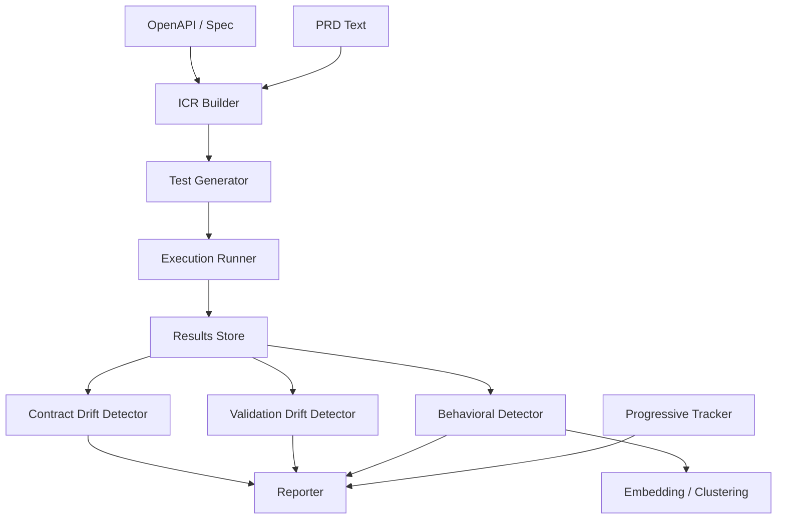

# API Behavioral Drift Detection Framework — Detailed Overview

**Last Updated: 2026-05-08**

This document describes the repository structure, component responsibilities, public functions and their inputs/outputs, internal principles, advantages, novelty, known drawbacks, and suggested future scope. It is intended for new contributors, reviewers, and researchers evaluating or extending the system.

## Executive Summary

The project is a research-grade framework for detecting multi-dimensional API drift. It combines symbolic contract checking, rule-based validation, statistical drift detection, and machine learning-driven behavioral modeling. The framework accepts multi-fidelity inputs (OpenAPI specs and PRDs), generates targeted tests, executes them against live or mocked APIs, and analyzes results to produce explainable drift reports.

## Minimal CLI Commands

This project provides a very small, user-friendly CLI. Use these two commands for the typical workflow:

- `acv init` — generate `acv_config.yaml` with sensible defaults in the current directory.
- `acv validate` — run the validation using `acv_config.yaml` (or provide a spec path). No extra flags required.

Examples:

```powershell
acv init
acv validate
```

## Repository Layout (high level)

- `src/` — Main implementation modules.
  - `analysis/drift/` — Detectors: `contract.py`, `validation.py`, `behavioral.py`, `progressive.py`.
  - `generation/` — Test-case generators and prioritizers.
  - `ml/` — Embedding, clustering, anomaly detection helpers.
  - `schema/contract/` — Contract model and ICR builder.
  - `execution/runner.py` — HTTP executor, retry & parallel logic.
- `evaluation/` — Datasets, evaluation harnesses, scripts for benchmarking.
- `examples/` — Demo scripts and integration examples.
- `docs/` — Documentation and guides (this file lives here).
- `requirements*.txt`, `pyproject.toml` — dependency and packaging config.
- `tests/` — Unit and integration tests.

See `CLAUDE.md` for high-level research notes and design rationale.

## Core Concepts & Components

1. Unified Contract Representation (ICR)
   - Purpose: Merge OpenAPI (high-fidelity) and PRD (low-fidelity) specifications into a single canonical contract model.
   - Key files: `src/schema/contract_model.py`, `src/schema/constraint_extractor.py`.
   - Inputs: OpenAPI JSON/YAML, raw PRD text.
   - Outputs: Graph-like contract object describing endpoints, fields, types, constraints, provenance and confidence scores.
   - Principles: Conservative merging, confidence-weighted constraints, source provenance tagging.

2. Intelligent Test Generation
   - Purpose: Produce valid, invalid, boundary, cross-field, and semantic adversarial test cases.
   - Methods implemented:
     - Rule-Based: deterministic tests from explicit constraints.
     - Constraint Solving: SMT-style generation for cross-field constraints.
     - LLM-Assisted: semantic adversarial generation from PRDs.
   - Inputs: ICR, generator config, random seed.
   - Outputs: Test case list (request payloads, expected status/behavior, metadata).
   - Key files: `src/generation/generator.py`, `src/generation/constraint_solver.py`, `src/generation/llm_generator.py`.

3. Execution Runner
   - Purpose: Execute generated tests with robust HTTP handling and retries.
   - Inputs: Test case list, target base URL, auth/config.
   - Outputs: Execution results (status code, headers, body, timings, error trace)
   - Key features: parallel execution, idempotent retries, pluggable transport adapters for mocking.
   - Key files: `src/execution/runner.py`.

4. Drift Analysis Layers
   - Symbolic (Contract Drift)
     - Purpose: Check response structures vs ICR schema.
     - Inputs: Response body, ICR schema.
     - Outputs: Field-level violations (missing, type mismatch, extra fields).
     - File: `src/analysis/drift/contract.py`.

   - Rule-Based (Validation Drift)
     - Purpose: Ensure the API rejects invalid inputs (4xx) when expected.
     - Inputs: Invalid test cases and responses.
     - Outputs: Acceptance rates for invalid inputs and concrete examples.
     - File: `src/analysis/drift/validation.py`.

   - Statistical / Behavioral
     - Purpose: Measure semantic divergence between expected and actual responses using embedding and distributional metrics.
     - Inputs: Response embeddings or feature vectors for baseline and current runs.
     - Outputs: Drift scores (JS/KL divergence, cosine dissimilarity), anomaly flags.
     - File: `src/analysis/drift/behavioral.py`.

   - Progressive (Time-Series)
     - Purpose: Detect gradual changes over time (latency, error-rate trends, embedding drift over sliding windows).
     - Inputs: Time-stamped metrics stream.
     - Outputs: Change-points and trend alerts.
     - File: `src/analysis/drift/progressive.py`.

5. Root Cause Explanation & Reporting
   - Purpose: Convert detector outputs into actionable and explainable remediation suggestions.
   - Inputs: Combined detector outputs, ICR, test metadata.
   - Outputs: Human-readable report with evidence, confidence scores, suggested fixes, and code snippets.
   - File: `src/reporting/` (markdown & JSON reporters).

6. ML Components
   - Purpose: Embed responses/requests, cluster behaviors, detect anomalies, and predict drift.
   - Inputs: Raw responses, pre-trained embedding model name.
   - Outputs: Embeddings, cluster assignments, anomaly scores.
   - Key libs: `sentence-transformers`, `scikit-learn`, `PyTorch` (configurable via `requirements.txt`).

## Public Functions / APIs (typical)

- Contract parsing: `parse_openapi(spec_path) -> Contract` — reads OpenAPI and returns contract dict.
- PRD extraction: `extract_constraints(prd_text) -> List[Constraint]` — returns inferred constraints with confidences.
- Build ICR: `build_icr(openapi_contract, prd_constraints) -> ICR` — merges sources.
- Generate tests: `generate_tests(icr, mode='rule'|'smt'|'llm', n=100) -> List[TestCase]`.
- Run tests: `execute_tests(test_cases, base_url, concurrency=10) -> List[Result]`.
- Detect contract drift: `detect_contract_drift(results, icr) -> ContractDriftReport`.
- Detect validation drift: `detect_validation_drift(results) -> ValidationDriftReport`.
- Compute embeddings: `embed_responses(responses, model_name) -> ndarray`.
- Compute behavioral drift: `compute_behavioral_drift(baseline, current) -> float`.
- Track progressive drift: `progressive_tracker.record(metric)`, `progressive_tracker.detect()`.

Each function returns typed objects (dataclasses) with `is_drift`, `confidence`, and `evidence` fields for downstream aggregation.

## Inner Principles & Design Choices

- Hybrid detection: combine deterministic symbolic checks (high-precision) with statistical/ML methods (coverage for subtle behavior shifts).
- Confidence propagation: every inferred constraint or detection attaches a confidence score propagated to final explanations.
- Explainability-first: detectors emit evidence and remediation templates rather than raw scores.
- Modularity: pluggable generators, detectors, and reporters to support research experiments.
- Deterministic baselines: tests can be generated with seeds for reproducibility; ML parts support seeding where possible.

## Advantages

- Multi-dimensional coverage: catches schema, validation, behavioral and progressive drifts.
- Explainable root causes with confidence and remediation suggestions.
- Multi-fidelity input fusion (OpenAPI + PRD) increases coverage over OpenAPI-only tools.
- Extensible: you can swap embedding models, add detectors, or use different test generation strategies.

## Novel Contributions

- ICR (Unified Contract Representation): confidence-weighted fusion of structured and unstructured specifications.
- Hybrid detector stack: coordinated symbolic + statistical + ML approaches with an explainability layer.
- Semantic adversarial test generation using LLMs guided by PRDs.
- Progressive drift tracking targeted at long-running API degradation detection (change-point focused).

## Drawbacks & Limitations

- ML components require labeled baseline data or careful calibration to avoid false positives.
- LLM-assisted generation depends on external models (cost / privacy / determinism concerns).
- Constraint solving for very complex cross-field logic can be slow or require manual constraints tuning.
- Some detections produce probabilistic outputs that need human validation — risk of alarm fatigue.
- Integration with proprietary/closed APIs may need adapters for auth, rate-limits, and non-deterministic responses.

## Recommended Future Work & Scope

1. Causal root-cause analysis: use causal inference techniques to strengthen remediation hypotheses.
2. Active learning loop: request human labels for high-uncertainty detections and retrain behavioral models.
3. Federated baselines: enable sharing anonymized baseline embeddings across teams to improve detection for similar APIs.
4. Lightweight on-device embeddings: support CPU-friendly models for low-cost continuous monitoring.
5. CI integration templates: provide GitHub Actions workflows that run targeted validation on PRs.
6. Dashboard & visualization: an interactive UI to explore drift timelines, evidence, and suggested fixes.
7. Benchmarking suite: add more synthetic drift injection datasets and a leader board for model variants.

## How to Get Started (developer quick commands)

Install dev dependencies and run tests (example):

```powershell
python -m venv .venv
.\\.venv\\Scripts\\Activate.ps1
pip install -r requirements-dev.txt
pytest
```

Run a basic validation against a running API (example CLI from repo):

```powershell
acv validate --spec api/openapi.yaml --url http://localhost:8000
```

See `examples/DEMO.md` for runnable demonstrations.

### Included example files

This repository includes small example artifacts under the `examples/` folder to make it quick to try the CLI and inspect outputs:

- `examples/acv_config.yaml` — a minimal, valid `acv_config.yaml` you can use as-is for local demos and CI. It mirrors the fields described in this document.
- `examples/sample_report.json` — a short example of a generated JSON report showing summary scores and per-endpoint violations.

To run a quick demo using the example config (assumes a running API at the configured `url`):

```powershell
acv validate --config examples/acv_config.yaml --output outputs/ && type outputs\report.json
```

If you want a copy of the sample config in the current directory, run:

```powershell
copy examples\acv_config.yaml .\acv_config.yaml
```

---

## Contribution & Contact

Follow the repo `CONTRIBUTING.md` practices. For research questions, reference `CLAUDE.md` and the `docs/RESEARCH_METHODOLOGY.md`.

---

This file is intended as a living document. Update it alongside code changes that affect architecture, public APIs, or evaluation procedures.

## Data Models & Example Schemas

Below are the common dataclasses / JSON shapes used across the codebase. They are provided to make integration and testing easier.

- TestCase

```python
class TestCase:
    endpoint: str         # e.g. "POST /users"
    method: str           # HTTP method
    path: str             # path template
    params: dict          # path/query params
    headers: dict
    body: dict | None
    expected_status: int | List[int]
    tags: List[str]
    metadata: dict
```

- Result

```python
class Result:
    test_case_id: str
    status_code: int
    headers: dict
    body: dict | str
    duration_ms: float
    error: Optional[str]
    timestamp: datetime
```

- ContractDriftReport

```python
class ContractDriftReport:
    endpoint: str
    violations: List[{
        "field": str,
        "type": "missing"|"type_mismatch"|"extra",
        "expected": Any,
        "observed": Any,
        "confidence": float
    }]
    is_drift: bool
    confidence: float
    evidence: List[str]
```

## Example Test Case (JSON)

```json
{
  "id": "tc-0001",
  "endpoint": "POST /users",
  "method": "POST",
  "path": "/users",
  "headers": {"Content-Type": "application/json"},
  "body": {"email":"bad@example","age":15},
  "expected_status": [400],
  "tags": ["validation","edge"]
}
```

## Example Contract Drift Report (JSON)

```json
{
  "endpoint": "POST /users",
  "is_drift": true,
  "confidence": 0.92,
  "violations": [
    {"field":"email","type":"type_mismatch","expected":"string (email)","observed":null,"confidence":0.99},
    {"field":"age","type":"missing","expected":"integer","observed":null,"confidence":0.95}
  ],
  "evidence": ["8/10 responses missing 'age'","All responses with email failed regex check"]
}
```

## Example CLI/Programmatic Usage

Run a validation from the CLI (packaged entrypoint `acv`):

```powershell
acv validate --spec api/openapi.yaml --url http://localhost:8000 --mode rule --output reports/run1.json
```

Programmatic example (Python):

```python
from acv import parse_openapi, build_icr, generate_tests, execute_tests, detect_contract_drift

spec = parse_openapi("api/openapi.yaml")
icr = build_icr(spec, prd_text=None)
tests = generate_tests(icr, mode="rule", n=50)
results = execute_tests(tests, base_url="http://localhost:8000")
report = detect_contract_drift(results, icr)
print(report)
```

## Architecture Diagram



## Development Checklist (quick)

- [ ] Ensure `requirements-dev.txt` contains test dependencies (`pytest`, `pytest-cov`, `ruff`, `black`).
- [ ] Add example OpenAPI & PRD files under `examples/` for CI demo runs.
- [ ] Add a GitHub Actions workflow to run `pytest` and `ruff` on PRs.

## Quick Troubleshooting

- If `pytest` is not found: ensure the virtualenv is activated and `pip install -r requirements-dev.txt` was run.
- If embedding model fails to load: check `requirements.txt` and available GPUs or set `DEVICE=cpu`.

